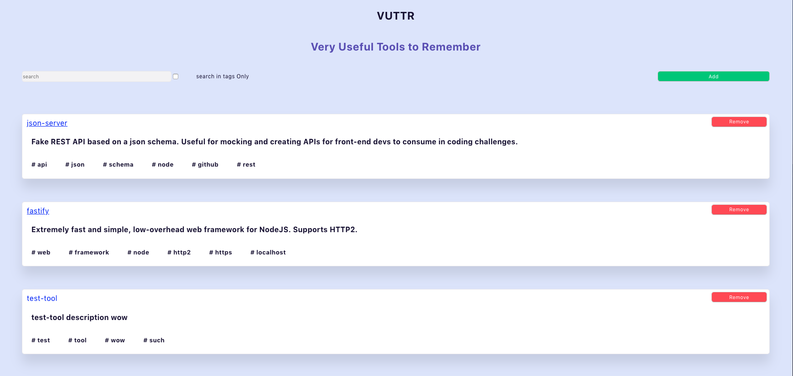
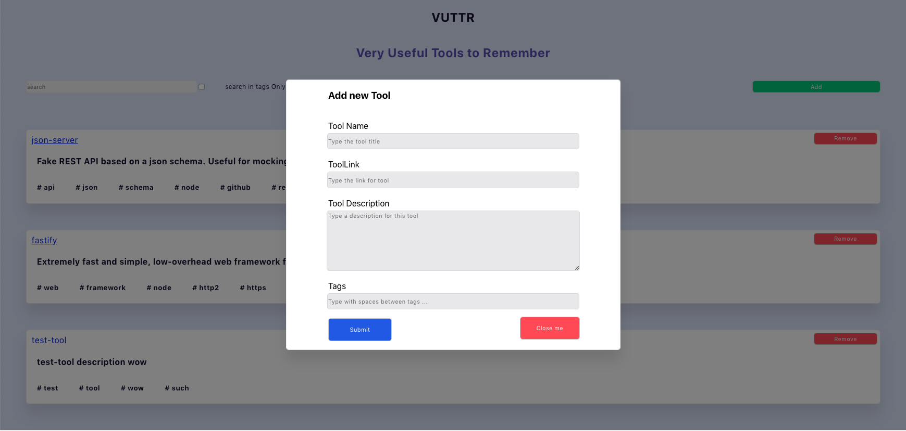
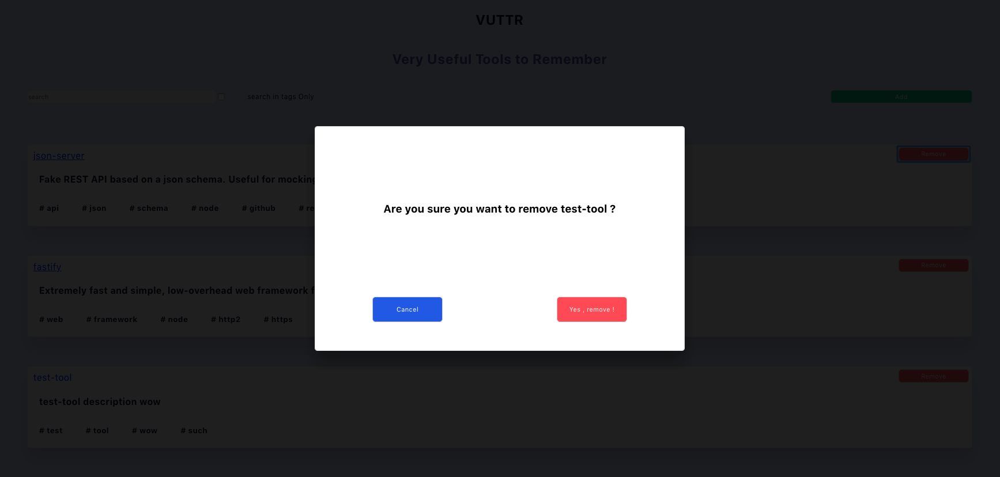

# VUTTR Project - Very Useful Tools to Remember
This is a project for a fron-end challenge for Bossabox. The application is a simple repository for managing tools with their  names, links, descriptions and tags.


# Setup on Terminal and Run Project Locally (fron-tend)
```terminal
git clone https://github.com/felipeeu/vuttr.git
cd vuttr
yarn install
yarn start
```
# Setup back-end on other terminal tab 
##### API run at http://localhost:3000
```terminal
 git clone https://gitlab.com/bossabox/challenge-fake-api.git
 cd challenge-fake-api
 npm install
 npx json-server db.json
```

# Demo

## Home

## Modal to add Tool 

## Modal to agree with delete



### Tech

Vuttr uses some technologies o work properly:

* [ReactJS] - a JavaScript library for building user interfaces
* [Styled Components] - to write actual CSS code to style components
* [Axios] - promise based HTTP client for the browser and node.js
* [Formik] - to build forms in React
* [Yup] - a JavaScript schema builder for value parsing and validation
* [Gh pages] - to deploy front-end
* [Heroku] - to deploy back-end


# Backend Server
  
All about the API is described in this repository [here](https://gitlab.com/bossabox/challenge-fake-api/-/tree/master)


## Create React App

This project was bootstrapped with [Create React App](https://github.com/facebookincubator/create-react-app). You can find more information on how to perform common tasks [here](https://github.com/facebookincubator/create-react-app/blob/master/packages/react-scripts/template/README.md).


